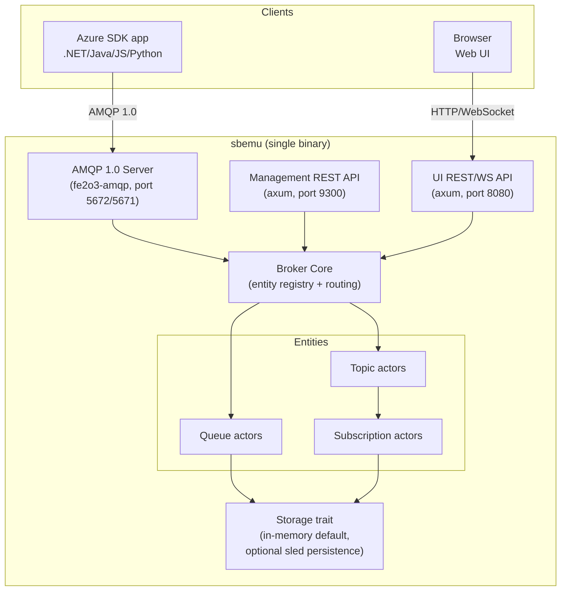

# Azure Service Bus Emulator (Rust) — Design Document

## 1. Goals

- Emulate Azure Service Bus **queues** and **topics/subscriptions** locally, well enough that unmodified
  applications using the official `Azure.Messaging.ServiceBus` SDKs (.NET, Java, JS, Python, Go) can connect
  to it exactly as they would to a real namespace, by pointing a connection string at `localhost`.
- Speak real **AMQP 1.0** on the wire (this is what every Azure Service Bus SDK uses under the hood), so no
  custom client library is required by consuming apps.
- Provide a **web management UI** to inspect what's inside the emulator: namespaces → queues/topics →
  subscriptions → messages (active, deferred, scheduled, dead-lettered), with peek (non-destructive) message
  viewing, manual send/purge, and live updates.
- Run as a single self-contained binary (optionally a Docker image), no external dependencies required for
  the default in-memory mode.
- Be honest about scope: this is a **development/test emulator**, not a clone of the whole Service Bus
  control plane (no geo-DR, no multi-tenant ARM, no billing, no real SLAs).

## 2. Non-goals (at least for v1)

- Multi-node clustering / high availability.
- Full Azure Resource Manager (ARM) API surface — only enough management surface to create/list/delete
  entities.
- Premium-tier specific features (dedicated capacity, VNET integration).
- 100% parity of every obscure AMQP annotation Azure uses; target the 80–90% that real SDKs exercise in
  normal send/receive/complete/dead-letter/session/schedule flows.

## 3. Prior art / reference points

- Microsoft ships an official **Service Bus emulator** (Docker-based, backed by a SQL Edge container and a
  static `config.json` describing entities). It proves the approach (AMQP-only data plane, config-driven
  topology) but its topology is static and it has no built-in UI. This design intentionally goes further by
  allowing runtime entity management and shipping a UI.
- `fe2o3-amqp` is a mature, pure-Rust AMQP 1.0 stack (used by Azure SDK for Rust itself) — it will be the
  backbone of the AMQP server instead of hand-rolling the protocol.

## 4. High-level architecture



Three network-facing surfaces, one shared core:

| Surface | Protocol | Default port | Purpose |
|---|---|---|---|
| Data plane | AMQP 1.0 (+ optional AMQPS) | `5672` / `5671` | Send/receive messages — what the Azure SDK uses |
| Management plane | HTTP/JSON | `9300` | Create/list/delete queues, topics, subscriptions, rules (subset of Service Bus REST API) |
| Web UI | HTTP + WebSocket | `8080` | Browser dashboard, backed by its own read/action API |

All three are just transport adapters over one in-process **Broker Core** — they never talk to each other
directly, only through the core, so behavior is consistent regardless of which "door" a client uses.

## 5. Workspace / crate layout

```
sbemu/
├── Cargo.toml                 # workspace
├── crates/
│   ├── sbemu-core/            # domain model, broker, storage trait, no I/O
│   ├── sbemu-store-mem/       # in-memory Storage impl (DashMap + VecDeque, default)
│   ├── sbemu-store-sled/      # optional persistent Storage impl (feature-gated)
│   ├── sbemu-amqp/            # AMQP 1.0 server adapter (fe2o3-amqp) -> core
│   ├── sbemu-mgmt-api/        # axum management REST adapter -> core
│   ├── sbemu-ui-api/          # axum UI REST + WebSocket adapter -> core
│   ├── sbemu-ui-web/          # static SPA assets, embedded via rust-embed
│   └── sbemu-cli/             # binary crate: wires everything together, config, tracing
└── config/
    └── example.config.json    # optional static bootstrap topology (like MS emulator)
```

Dependency direction is strictly inward: adapters (`amqp`, `mgmt-api`, `ui-api`) depend on `core`; `core`
never depends on any transport crate. This keeps the AMQP protocol code testable in isolation and means a
future gRPC or MQTT adapter could be added without touching domain logic.

## 6. Domain model (`sbemu-core`)

```rust
struct Namespace {
    name: String,
    queues: DashMap<String, Arc<QueueEntity>>,
    topics: DashMap<String, Arc<TopicEntity>>,
}

struct QueueEntity {
    name: String,
    options: EntityOptions,          // max_size, default TTL, lock_duration, dup-detection window...
    active: Mutex<VecDeque<BrokeredMessage>>,
    scheduled: Mutex<BinaryHeap<Scheduled<BrokeredMessage>>>, // ordered by enqueue-time
    deferred: DashMap<i64, BrokeredMessage>,                  // keyed by sequence number
    dead_letter: Mutex<VecDeque<BrokeredMessage>>,
    locks: DashMap<Uuid, LockEntry>,   // lock-token -> (message ref, expiry)
    sessions: DashMap<String, SessionState>, // only if requires_session
    stats: EntityStats,               // counts, sizes — feeds the UI
}

struct TopicEntity {
    name: String,
    options: EntityOptions,
    subscriptions: DashMap<String, Arc<SubscriptionEntity>>,
}

struct SubscriptionEntity {
    name: String,
    rules: DashMap<String, Rule>,      // SQL-filter / correlation-filter -> action
    // otherwise same shape as QueueEntity (active/scheduled/deferred/dead-letter/locks)
    inner: QueueLikeStorage,
}

struct BrokeredMessage {
    sequence_number: i64,
    message_id: String,
    body: Bytes,
    properties: HashMap<String, AmqpValue>,   // user/application properties
    system_properties: SystemProperties,      // enqueued_time, delivery_count, ttl, session_id...
    partition_key: Option<String>,
    correlation_id: Option<String>,
    scheduled_enqueue_time: Option<DateTime<Utc>>,
}

enum ReceiveMode { PeekLock, ReceiveAndDelete }
```

Design notes:
- **Sequence numbers** are monotonically increasing per-entity `i64` (matches Service Bus semantics), used
  as the addressable key for peek, defer, and dead-letter lookups shown in the UI.
- **Lock tokens** are `Uuid`s with an expiry (`lock_duration`, default 30s); a background reaper task scans
  and returns expired-lock messages to the head of the active queue, incrementing `delivery_count` (and
  dead-lettering if `max_delivery_count` exceeded) — the same rule the UI needs to display "locked until".
- **Sessions**: a subscription/queue with `requires_session = true` routes messages into per-`session_id`
  sub-queues; only one receiver can hold a session lock at a time. Modeled as `SessionState { locked_by:
  Option<ReceiverId>, queue: VecDeque<BrokeredMessage> }`.
- **Rules/filters** on subscriptions: v1 supports `CorrelationFilter` (exact match on well-known + custom
  properties) and a small SQL-like filter subset (`property = 'x'`, `AND`/`OR`, numeric comparisons) — enough
  for typical pub/sub routing demos without embedding a full SQL engine.

## 7. Concurrency model

- Every queue / subscription is an **actor**: a `tokio::task` owning its state, driven by an `mpsc` command
  channel (`Send`, `Receive`, `Complete(lock_token)`, `Abandon`, `DeadLetter`, `Defer`, `Peek{from_seq, count}`,
  `Purge`, `GetStats`). This avoids sprinkling `Mutex` locking order bugs across the codebase and gives a
  single place to enforce ordering (FIFO within a queue) and lock/TTL timers.
- The Broker Core holds a `DashMap` of entity name → actor handle (`mpsc::Sender<Command>`), so lookups are
  lock-free reads on the happy path.
- A single **reaper task** per entity (or one global tokio interval scanning all entities) expires locks,
  promotes scheduled messages into the active queue when their time arrives, and expires messages whose TTL
  has elapsed (moving them to dead-letter if `dead_lettering_on_message_expiration` is set).
- All adapters (AMQP, mgmt REST, UI API) are just producers of `Command` messages against actor handles —
  they never touch entity internals directly.

## 8. Storage layer

A small trait keeps persistence pluggable:

```rust
trait EntityStore: Send + Sync {
    fn load_topology(&self) -> Vec<EntityDefinition>;
    fn save_topology(&self, defs: &[EntityDefinition]);
    // Messages themselves stay in the actor's in-memory state for speed;
    // persistence backends snapshot/WAL them for restart durability.
}
```

- **Default**: pure in-memory (`sbemu-store-mem`) — fastest, resets on restart, perfect for CI/dev.
- **Optional** (`sbemu-store-sled`, feature flag): appends a write-ahead log per entity to `sled`/`redb` so
  message state and topology survive a restart — useful for longer-lived local dev environments.
- Either way, entity *topology* (which queues/topics/subscriptions/rules exist) can also be bootstrapped from
  a static `config.json` at startup, mirroring Microsoft's own emulator, for docker-compose/CI scenarios.

## 9. AMQP 1.0 protocol layer (`sbemu-amqp`)

Built on `fe2o3-amqp` + `fe2o3-amqp-types` + `fe2o3-amqp-management`:

- **Connection/session/link handling**: accept incoming TCP (and TLS via `rustls`/`rcgen`-generated
  self-signed cert for `amqps://`), negotiate SASL (accept `PLAIN`/`ANONYMOUS`; validate the SAS
  token/connection-string signature the same way real Service Bus does so existing connection strings work
  unmodified against `localhost`).
- **Address routing**: link target/source address maps to `queue-name`, `topic-name`, or
  `topic-name/Subscriptions/sub-name`, matching the addressing scheme Azure SDKs already generate.
- **Sender links (app → emulator)**: incoming transfers become `BrokeredMessage`s; message annotations
  (`x-opt-scheduled-enqueue-time`, `x-opt-partition-key`, etc.) map onto the domain model fields above.
- **Receiver links (emulator → app)**:
  - `ReceiveAndDelete` mode: pop and send, no lock bookkeeping.
  - `PeekLock` mode: send message, create a lock entry; SDK `Complete`/`Abandon`/`DeadLetter`/`Defer` arrive
    as AMQP dispositions (`accepted`/`released`/`rejected`/`modified`) which the adapter translates back into
    `Command`s against the owning actor.
- **`$cbs`/`$management` links**: implement the Service Bus AMQP management link subset needed for
  runtime operations some SDKs perform over AMQP (e.g., renew-lock, session-related requests, scheduled
  message add/cancel) using `fe2o3-amqp-management`.
- This crate is the thin, most protocol-literal layer; it should contain **no business logic** beyond
  translating AMQP frames ⇄ `Command`s, so it stays testable against `fe2o3-amqp`'s own client for
  conformance tests.

## 10. Management REST API (`sbemu-mgmt-api`)

A pragmatic subset of the real Service Bus management REST/ARM surface, enough for
`ServiceBusAdministrationClient` and for the emulator's own CLI/UI to manage topology at runtime:

```
PUT    /namespaces/{ns}/queues/{name}            create/update queue
GET    /namespaces/{ns}/queues                   list queues
GET    /namespaces/{ns}/queues/{name}             get queue (incl. runtime stats)
DELETE /namespaces/{ns}/queues/{name}
PUT    /namespaces/{ns}/topics/{name}
GET    /namespaces/{ns}/topics/{name}/subscriptions
PUT    /namespaces/{ns}/topics/{name}/subscriptions/{sub}
PUT    /namespaces/{ns}/topics/{name}/subscriptions/{sub}/rules/{rule}
DELETE ...
```

Auth: same SAS-token validation as the AMQP layer (shared code path), so one connection string works against
both planes.

## 11. Web UI

Two parts:

1. **`sbemu-ui-api`** (axum): read/action endpoints purpose-built for the dashboard —
   - `GET /ui/entities` — tree of namespaces/queues/topics/subscriptions with live counts (active, scheduled,
     deferred, dead-letter, delivery-count histograms).
   - `GET /ui/queues/{name}/messages?state=active|deferred|deadletter&from=&count=` — **peek** (non-destructive,
     uses AMQP peek semantics under the hood) rendering message body (auto-detected JSON/text/base64) + all
     system/user properties.
   - `POST /ui/queues/{name}/messages` — send a test message (body + properties editor) for quick manual
     testing without needing a separate client app.
   - `POST /ui/queues/{name}/purge`, `POST /ui/messages/{seq}/dead-letter`, `.../resubmit`, `.../delete` —
     admin actions.
   - `GET /ui/ws` — WebSocket pushing entity stat deltas + new-message events so the dashboard updates live
     instead of polling.
2. **`sbemu-ui-web`**: a small SPA (Svelte or plain TS + Vite — lightweight, fast build) compiled to static
   assets and embedded into the binary with `rust-embed`, so the whole emulator ships as **one executable**
   with no separate web server/deploy step. Screens:
   - Namespace overview: queues/topics with active/DLQ counts, sparkline of throughput.
   - Queue/subscription detail: tabs for Active / Scheduled / Deferred / Dead-letter messages, each a table
     (seq #, message-id, enqueued time, delivery count, size) expandable to full body + properties (with
     JSON pretty-print and copy-to-clipboard).
   - "Send message" panel (JSON/text body, custom properties, scheduled-enqueue-time picker, session-id).
   - Live event log (connections opened, sends, receives, completions, dead-letters) for demo/debugging.

## 12. Configuration & bootstrap

`sbemu.toml` (or `--config`/env vars via the `config` crate):

```toml
[server]
amqp_port = 5672
amqps_port = 5671        # optional, self-signed cert auto-generated on first run
mgmt_port = 9300
ui_port = 8080
persistence = "memory"   # or "sled" with a data_dir

[[queues]]
name = "orders"
max_delivery_count = 10
lock_duration_secs = 30
requires_session = false

[[topics]]
name = "events"
[[topics.subscriptions]]
name = "audit-log"
```

Plus fully dynamic creation at runtime via the management API/UI — static config is just a convenience
bootstrap (handy for docker-compose + CI), not a hard requirement.

## 13. Deployment

- Single statically-linked binary (`sbemu-cli`), works standalone: `sbemu --config sbemu.toml`.
- `Dockerfile` (multi-stage build, `scratch`/`distroless` final image) exposing `5672/5671/9300/8080`.
- `docker-compose.yml` example for local dev, mounting a config file and a volume for the optional sled data
  directory.
- Connection string surfaced on startup log, e.g.
  `Endpoint=sb://localhost:5672/;SharedAccessKeyName=RootManageSharedAccessKey;SharedAccessKey=<generated>`
  — copy/paste straight into `appsettings.json`/`.env` of the consuming app.

## 14. Testing strategy

- **Unit tests** in `sbemu-core` for broker/actor logic (lock expiry, dead-lettering, filters, sessions) —
  no networking involved, fast.
- **Protocol conformance tests**: spin up the real binary in-process, drive it with `fe2o3-amqp`'s client
  crate directly (send/peek-lock/complete/dead-letter/session/scheduled round-trips).
- **SDK smoke tests**: a small `.NET` (and optionally Python) test project using the actual
  `Azure.Messaging.ServiceBus` package pointed at `localhost`, run in CI, to catch any real-world
  incompatibility fe2o3-amqp-only tests might miss.
- **UI**: component/e2e tests (Playwright) against the SPA, plus a couple of end-to-end tests that send via
  AMQP and assert the message shows up via the UI API.

## 15. Phased roadmap

| Phase | Scope |
|---|---|
| 0 | Workspace scaffold, core domain model, in-memory store, tracing/logging setup |
| 1 (MVP) | Queues only: AMQP send/receive (both modes), complete/abandon/dead-letter, management REST for queue CRUD, read-only UI (tree + peek) |
| 2 | Topics/subscriptions + rule filters, dead-letter browsing/resubmit in UI, send-test-message UI, WebSocket live updates |
| 3 | Sessions, scheduled messages, message deferral, duplicate detection, TTL/auto-delete-on-idle |
| 4 | AMQPS/TLS, SAS parity hardening, sled persistence, config.json static bootstrap compatible with MS emulator format |
| 5 (stretch) | Transactions, auto-forwarding between entities, `$management` link renew-lock, multi-namespace support |

## 16. Key crate choices

| Concern | Crate |
|---|---|
| Async runtime | `tokio` |
| AMQP 1.0 | `fe2o3-amqp`, `fe2o3-amqp-types`, `fe2o3-amqp-management` |
| HTTP/WebSocket | `axum`, `tokio-tungstenite` (or axum's built-in ws) |
| Concurrent maps | `dashmap` |
| Serialization | `serde`, `serde_json` |
| IDs/time | `uuid`, `chrono` (or `time`) |
| Config | `config`, `serde` |
| Embedded static assets | `rust-embed` |
| TLS | `rustls`, `rcgen` (self-signed dev certs) |
| Optional persistence | `sled` or `redb` |
| Observability | `tracing`, `tracing-subscriber` |
| CLI | `clap` |

---

This document is the blueprint; nothing has been scaffolded yet per your request. Ready to start on Phase 0
(workspace + core domain model) whenever you want to move to implementation.
