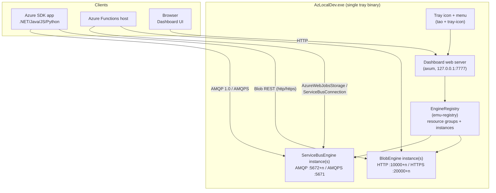

# Az.Local.Dev — Design Document

> Moved from the repo root (`DESIGN.md`) and rewritten to match what's actually implemented. The original
> version described a much larger planned architecture (namespaces, topics/subscriptions, a separate
> management REST API, sled persistence, Docker deployment, a Svelte SPA) that was never built - this
> version documents the real, simpler system as it exists today, plus what's still on the roadmap.

## 1. Goals

- Emulate Azure resources locally, well enough that **unmodified** applications using the official Azure
  SDKs (.NET, Java, JS, Python, Go) - and Azure Functions itself - can connect to them exactly as they would
  to real Azure, just by pointing a connection string (or identity-based config) at `localhost`.
- Speak the **real wire protocols** for each resource (AMQP 1.0 for Service Bus, the real Blob REST API for
  Storage) rather than a custom client library.
- Ship as a single **system-tray application** with a **browser dashboard** for managing everything -
  create/rename/start/stop/delete resource groups and resources, browse their contents, no external
  dependencies, no separate server process to run.
- Auto-persist everything so state survives restarts, with zero manual "save session" step.
- Be honest about scope: this is a **development/test emulator**, not a clone of the whole Azure control
  plane (no ARM, no billing, no real auth/RBAC, no multi-tenant anything).

## 2. Non-goals

- Multi-node clustering / high availability.
- Full Azure Resource Manager (ARM) API surface.
- 100% protocol parity for every obscure feature; target the 80-90% real SDKs exercise in normal flows.
- Real Managed Identity / Entra ID token validation - see [§8](#8-managed-identity-style-connections) for
  why this is fundamentally out of scope for *any* local emulator, not just this one.
- Linux/macOS support - the tray app, dev-cert trust flow, and IPC choices are Windows-specific today.

## 3. High-level architecture



One process, no external dependencies. The dashboard is "just a web page" - opening it is a convenience
(tray icon click), not a separate thing to start.

## 4. Workspace / crate layout

```
Cargo.toml                              # workspace: members + shared [workspace.dependencies]
emu/
├── services/
│   ├── engine/                         # emu-registry: generic EmulatorEngine trait + EngineRegistry
│   └── dev-cert/                       # emu-dev-cert: shared self-signed TLS cert, generate/trust
├── module/
│   ├── servicebus/
│   │   ├── core/                       # emu-servicebus-core: Broker, entities, message states
│   │   ├── amqp/                       # emu-servicebus-amqp: AMQP 1.0 (+AMQPS) wire protocol
│   │   └── engine/                     # emu-servicebus-engine: EmulatorEngine impl + REST API
│   └── storage/
│       └── blob/
│           ├── core/                   # emu-storage-blob-core: BlobStore (containers/blobs)
│           ├── server/                 # emu-storage-blob-server: Blob REST wire protocol
│           └── engine/                 # emu-storage-blob-engine: EmulatorEngine impl + REST API
└── ui/
    ├── web/                            # emu-web: dashboard REST API, static assets, persistence
    └── gui/                            # emu-gui: the tray binary (AzLocalDev.exe), wires everything
```

Dependency direction is strictly inward: `emu-registry` knows nothing about Service Bus or Storage; each
module (`emu-servicebus-*`, `emu-storage-blob-*`) is a self-contained crate providing an `EmulatorEngine`
impl plus its own REST routes, following one template (see [§5](#5-the-emulatorengine-pattern)). Adding a
new resource kind (e.g. Storage Queue/Table) never requires touching `emu-registry` or `emu-web`/`emu-gui`
beyond one `register_kind(...)` call.

## 5. The `EmulatorEngine` pattern

Every emulated resource kind implements one trait (`emu-registry::EmulatorEngine`):

```rust
#[async_trait]
pub trait EmulatorEngine: Send + Sync {
    fn id(&self) -> &str;
    fn kind(&self) -> &'static str;
    fn display_name(&self) -> String;
    fn rename(&self, new_name: &str);
    async fn start(&self) -> anyhow::Result<()>;
    async fn stop(&self) -> anyhow::Result<()>;
    async fn is_running(&self) -> bool;
    async fn detail(&self) -> Option<String>;   // connection string(s) shown in the dashboard
    fn config(&self) -> serde_json::Value;      // opaque, kind-specific: used to persist/restore
}
```

`EngineRegistry` (in `emu-registry`) holds every instance + resource group, and a `Factory` closure per
`kind` (registered once in `emu-gui/src/main.rs`) so the dashboard's generic "New resource" flow can
construct any kind by name alone, with no `emu-web`/`emu-registry` code needing to know concrete types.

Each module additionally exposes its own small `Registry` (e.g. `ServiceBusRegistry`, `StorageBlobRegistry`)
- a `HashMap<id, Arc<ConcreteEngine>>` - so that module's own REST routes can call concrete methods (e.g.
  `ServiceBusEngine::connection_string()`) without downcasting the generic trait object.

## 6. Service Bus module

- **`emu-servicebus-core`**: `Broker` (actor-per-entity model), queues only (no topics/subscriptions in the
  current build) with active/scheduled/deferred/dead-lettered message states, peek-lock semantics, lock
  expiry/redelivery.
- **`emu-servicebus-amqp`**: real AMQP 1.0 wire protocol via `fe2o3-amqp`, plus an AMQPS (TLS) listener for
  Managed-Identity-style clients (see [§8](#8-managed-identity-style-connections)). SASL is fully permissive
  - any credentials/SAS token are accepted, matching a real connection string's *shape* without validating
  its *contents*.
- **`emu-servicebus-engine`**: wires the two into a runnable `ServiceBusEngine` (one AMQP port + one
  dedicated AMQPS loopback address per instance), plus this module's own axum router (queue/message CRUD)
  nested under `/api/service-bus` in the dashboard.
- A locally-patched `fe2o3-amqp` (`vendor/fe2o3-amqp`, via `[patch.crates-io]`) adds a custom delivery-tag
  override, needed so Azure SDK clients can derive a 16-byte GUID lock token from it (upstream only exposes
  a fixed 4-byte auto-generated tag).

## 7. Storage (Blob) module

- **`emu-storage-blob-core`**: `BlobStore` - containers + block blobs (bytes + content-type/etag/metadata),
  plain in-memory `DashMap`-backed, no I/O.
- **`emu-storage-blob-server`**: the real **Blob REST API** wire protocol (path-style,
  `/{account}/{container}/{blob}`, Azurite's `devstoreaccount1` convention) over `BlobStore` - container
  create/delete/list, single-shot block blob upload/download/delete/list, `x-ms-meta-*` metadata. Auth is
  fully permissive (no signature/SAS validation), same philosophy as the AMQP listener.
- **`emu-storage-blob-engine`**: wires the two into a runnable `BlobEngine`, running **two** listeners per
  instance:
  - Plain HTTP on the assigned port (starts at `10000`) - for account-key connection strings.
  - HTTPS on `<port> + 10000` (e.g. `20000`) - for `TokenCredential`-based (Managed Identity-style) clients,
    using the shared dev cert (see [§9](#9-shared-dev-tls-certificate-emu-dev-cert)). Azure Core's
    bearer-token auth policy refuses to send a token over plain HTTP, so this second listener is required
    for that auth style to work at all.
- Deliberately out of scope for now: append/page blobs, leases, snapshots/versioning, soft delete, tiers/tags.
- **Not yet emulated**: Storage Queue and Table services. This means the Blob emulator alone is *not* a full
  `AzureWebJobsStorage` replacement for apps using Durable Functions, blob-trigger polling, or queue
  triggers - only plain Blob input/output bindings and the Functions host's own internal bookkeeping (host
  lock blobs, function keys) are covered.

## 8. Managed Identity-style connections

Real Managed Identity requires a live Microsoft Entra ID tenant on both ends - the Functions host requests a
token from real Entra, and the target service validates it against Entra. Neither side of that can be
emulated locally, which is also why Azurite never supported it.

What *does* work: if an app constructs its client from a `TokenCredential` (e.g. `DefaultAzureCredential`)
instead of a connection string, it still works against this emulator - neither the AMQPS listener nor the
Blob HTTPS listener validate the token they're handed, so whatever credential the developer's machine
resolves locally (`az login`, Visual Studio, VS Code) is accepted as-is. This requires:

1. A real TLS listener (Azure Core's bearer-token policy refuses plain HTTP/AMQP outright) - see
   [§9](#9-shared-dev-tls-certificate-emu-dev-cert).
2. The right endpoint value: `fullyQualifiedNamespace` (Service Bus) / `blobServiceUri` (Blob), both surfaced
   in the dashboard's resource details modal.

See the [README](../README.md#using-with-azure-functions) for concrete `local.settings.json` examples.

## 9. Shared dev TLS certificate (`emu-dev-cert`)

A single self-signed certificate (for `localhost`/`127.0.0.1`, persisted under
`%APPDATA%/AzLocalDev/certs/`) is shared by every TLS listener (Service Bus AMQPS, Storage Blob HTTPS) so
there's only one certificate to generate and trust, not one per resource.

- `emu_dev_cert::load_or_generate()` loads the persisted cert/key, generating a fresh pair on first run.
- `DevCertificate::is_trusted()` checks a marker file (`dev-cert.trusted`) written by `trust()` on success -
  this crate **never** silently modifies the OS certificate store; it only reports status and performs the
  trust operation when explicitly asked to.
- `emu-gui` is the only caller that ever calls `.trust()` - once at startup, after asking the user via a
  native Windows message box (`dev_cert_prompt.rs`, built on `windows-sys`'s `MessageBoxW`). Declining just
  means TLS-based (Managed Identity-style) clients won't validate the cert until trusted manually
  (`certutil -user -addstore Root <path>`) - the plain connection-string listeners are unaffected either way.

## 10. Persistence

Two independent, complementary layers, both under `%APPDATA%/AzLocalDev/`:

- **Resource group topology** (`groups/{group-id}.json`, owned by `emu-web`): one JSON file per resource
  group, containing the group's metadata plus every resource inside it (`id`, `kind`, `name`, and that
  resource's own `config()` blob - e.g. the assigned port). Rewritten on every create/rename/delete of a
  group or a resource inside it. Loaded automatically on startup (`emu_web::load_all_groups`) - there is no
  manual "save session" step; everything is always in sync.
- **Per-instance data** (`data/service-bus/{id}.json`, `data/storage-blob/{id}.json`, owned by each engine
  module): the actual queue/message or container/blob contents for one instance, flushed on a background
  timer (every 5s) and on clean shutdown. Each file stamps its own owning instance `id` in the content
  (`PersistedInstanceData { id, ..dump }`), verified on load against the filename-implied id - a mismatch is
  rejected (logged, not silently loaded) rather than trusting the filename alone.

Port/instance-sequence counters in `emu-gui/src/main.rs` are bumped past whatever was just restored
(`fetch_max`) before any new resource can be created in the same run, so restored and newly-created
instances can never collide.

## 11. Dashboard (`emu-web` + static assets)

- `emu-web` exposes the generic control API (`/api/resource-groups`, `/api/engines`, `/api/resource-kinds`)
  plus static asset serving (embedded HTML/CSS/JS under `emu/ui/web/assets/`); each resource module nests
  its own REST routes (`/api/service-bus`, `/api/storage-blob`) alongside it in `emu-gui/src/main.rs`.
- The frontend (`assets/index.html` + `app.js` + `style.css`) is a small vanilla-JS single-page app: sidebar
  nav (Running Resources / Resources-by-kind / Resource Groups), a generic "New resource" flow driven by
  `/api/resource-kinds`, a global search box, and per-kind detail views (Service Bus queues/messages,
  Storage containers/blobs).
- Branding: "Az.Local.Dev" in the dashboard UI; the tray/window icon and dashboard favicon share one
  canonical SVG (`emu/ui/web/assets/icon.svg`) - an azure-blue cloud with a centered gray gear.

## 12. The tray application (`emu-gui`)

- `[[bin]] name = "AzLocalDev"` (package is `emu-gui`) - built with `#![windows_subsystem = "windows"]` so it
  never pops up a console window (Rust's default "console" subsystem otherwise always allocates one).
- Uses `tao` for the Win32 message loop (required for the tray icon to function, even with no visible
  window) and `tray-icon` for the icon/menu itself. Left-click opens the dashboard in the default browser;
  right-click shows a native Open/Quit context menu - explicitly only reacting to `MouseButton::Left` +
  `MouseButtonState::Up` `Click` events so a right-click doesn't *also* open the dashboard behind its own
  context menu.
- `main()` is fully synchronous startup code (registers resource kinds, restores persisted groups or creates
  the first-run default, prompts to trust the dev cert) before handing off to `tao`'s blocking event loop;
  all engine work happens on a separate `tokio` multi-thread runtime spun up once at the top.

## 13. Roadmap / possible future work

- Storage Queue and Table emulation, as siblings of `emu-storage-blob-*`, sharing one account so
  `AzureWebJobsStorage` can be a complete drop-in for Durable Functions and blob-trigger polling.
- Service Bus topics/subscriptions (the original design's scope) - not yet built; only queues exist today.
- Block-list (`Put Block`/`Put Block List`) large-blob upload support - v1 only supports single-shot `Put
  Blob`.
- Linux/macOS support for the tray app and dev-cert trust flow (currently Windows-only: `certutil`,
  `windows-sys` message boxes).
